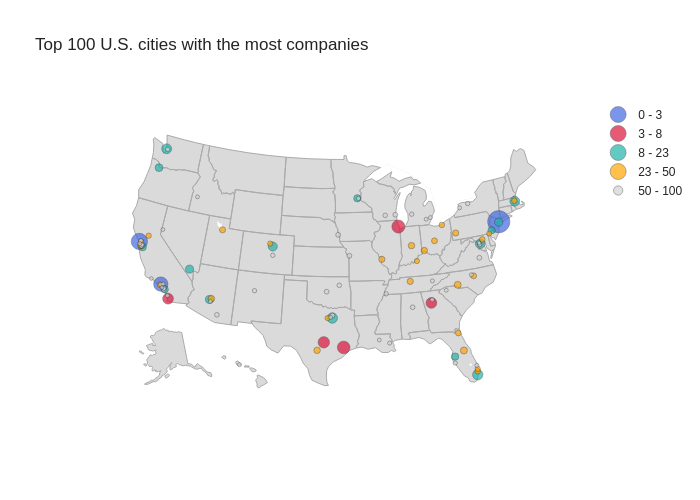

# Crunchbase Company Profiles: An Analysis
View the Jupyter notebook: [crunchbase-analysis.ipynb](//github.com/christianmendoza/crunchbase-organization-analysis/blob/main/crunchbase-analysis.ipynb)

Using [pandas](https://pandas.pydata.org/) to analyze organization profiles available on Crunchbase's platform via its daily CSV export, and [plotly.express](https://plotly.com/python/plotly-express/) to plot the geographic data.

- Organization dataset via [Crunchbase Data](https://data.crunchbase.com/docs/daily-csv-export)
- `Country Code <-> Country Name` table: [opendatasoft](https://www.opendatasoft.com/), [dataset](https://public.opendatasoft.com/explore/dataset/countries-codes/export/?rows=1)
- `Country Code <-> Continent` table: [stevewithington](https://gist.github.com/stevewithington), [dataset](https://gist.githubusercontent.com/stevewithington/20a69c0b6d2ff846ea5d35e5fc47f26c/raw/13716ceb2f22b5643ce5e7039643c86a0e0c6da6/country-and-continent-codes-list-csv.csv)
- `U.S. State Abbr <-> U.S. State Name` table: [census.gov](https://www.census.gov/library/reference/code-lists/ansi.html#state), [dataset](https://www2.census.gov/geo/docs/reference/state.txt)
- `U.S. City <-> Lat/Long Coords` table: [SimpleMaps](https://simplemaps.com/data), [dataset](https://simplemaps.com/data/us-cities)